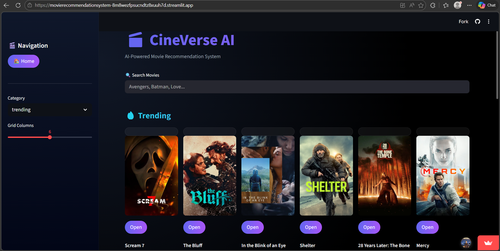
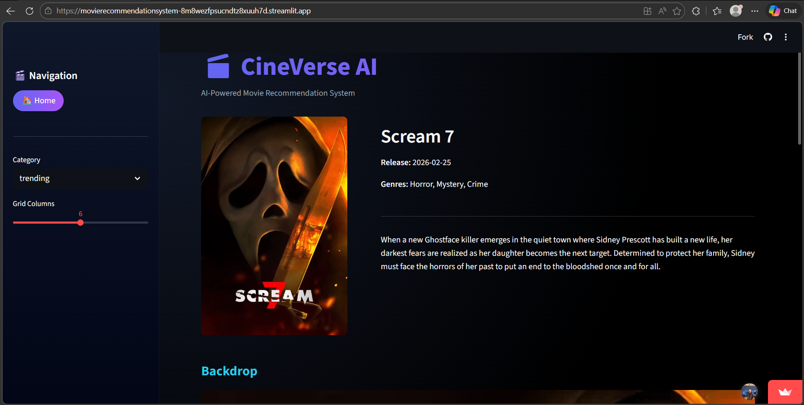
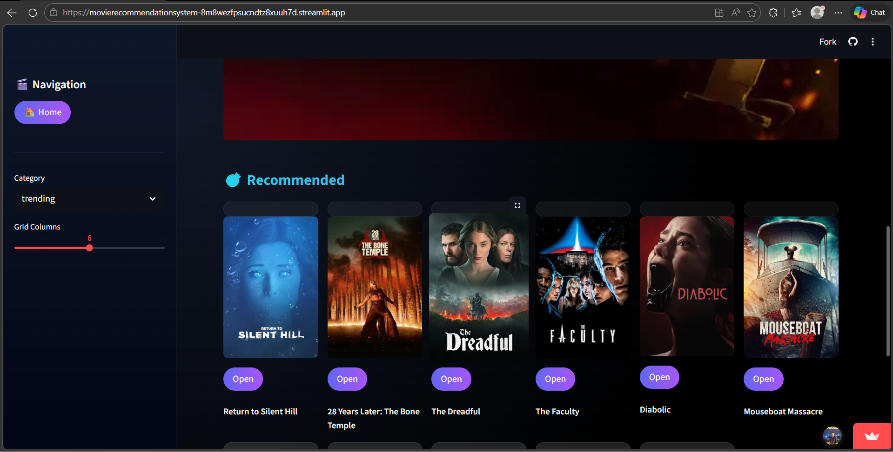

# 🎬 CineVerse AI  
### Hybrid Movie Recommendation Intelligence System  

A **production-grade full-stack AI application** that delivers personalized movie recommendations using **Content-Based Filtering (TF-IDF + Cosine Similarity)** and **Live TMDB Genre Discovery** — deployed with **FastAPI (Render)** and **Streamlit Cloud**.

This project demonstrates real-world ML deployment, backend–frontend architecture, API orchestration, and hybrid recommendation intelligence — all inside a premium, recruiter-ready cinematic dashboard.

---

## 🚀 Live Application

👉 **https://movierecommendationsystem-8m8wezfpsucndtz8xuuh7d.streamlit.app/**  

---

## 📸 Application Preview

  
    
  
    
  

---

## 🏗️ System Architecture

1️⃣ User interacts with a premium Streamlit UI  
2️⃣ Frontend sends request to FastAPI backend (Render)  
3️⃣ Backend performs:
   - TF-IDF similarity computation  
   - TMDB metadata retrieval  
   - Genre-based discovery  
4️⃣ Hybrid recommendation bundle is returned  
5️⃣ Results rendered in a cinematic UI grid  

---

## ✨ Project Highlights

- Hybrid Recommendation System (Content + Genre)  
- Sparse Matrix TF-IDF similarity (efficient & scalable)  
- Real-time TMDB API integration  
- Fully separated Backend & Frontend  
- Production deployment (Render + Streamlit Cloud)  
- Premium dark UI with glassmorphism effects  
- Designed for FAANG-level portfolios  

---

## 🧠 Problem Statement

Most movie recommenders either use collaborative filtering (requires user data) or static similarity models.

Real-world systems require:

- Content-based reasoning  
- Genre-based discovery  
- Real-time metadata  
- Hybrid intelligence logic  

CineVerse AI solves this using a hybrid recommendation engine.

---

## 🧠 Recommendation Logic

### 🔍 Content-Based Filtering (TF-IDF)

- Movie metadata vectorized  
- Cosine similarity computed  
- Top-N similar movies selected  
- Efficient sparse matrix operations  

Similarity formula:
similarity = (TFIDF_matrix @ query_vector.T)

---

### 🎭 Genre-Based Recommendation (TMDB Discover API)

- Fetch selected movie genre  
- Query TMDB Discover endpoint  
- Return popular movies in same genre  
- Remove current movie from results  

---

## 🖥️ Tech Stack

### 💻 Backend
- FastAPI  
- Uvicorn  
- HTTPX  
- Pandas  
- NumPy  
- Scikit-learn  
- Pickle (Precomputed TF-IDF matrix)  

### 🎨 Frontend
- Streamlit  
- Custom CSS (Premium Cinematic UI)  

### ☁️ Deployment
- Render (FastAPI backend)  
- Streamlit Cloud (Frontend)  

---

## 📁 Project Structure

movie-recommendation-system/
│
├── main.py
├── app.py
├── df.pkl
├── tfidf.pkl
├── tfidf_matrix.pkl
├── indices.pkl
├── movies_metadata.csv
├── requirements.txt
└── README.md

---

## ▶️ Run Locally

git clone https://github.com/kamrankausher/Movie_Recommendation_System.git
cd Movie_Recommendation_System

python -m venv venv
venv\Scripts\activate

pip install -r requirements.txt
pip install uvicorn fastapi python-dotenv httpx

# Add .env file
TMDB_API_KEY=your_tmdb_key_here

# Run backend
uvicorn main:app --reload

# Run frontend
streamlit run app.py

---

## ☁️ Deployment

### 🚀 Backend (Render)

1. Create Web Service  
2. Connect GitHub repository  
3. Add environment variable:
TMDB_API_KEY=your_key

4. Start command:
uvicorn main:app --host 0.0.0.0 --port 10000
---

### 🌐 Frontend (Streamlit Cloud)

1. Connect GitHub repo  
2. Set `app.py` as entry file  
3. Update `API_BASE` to Render backend URL  
4. Deploy  

---

## 🎯 Use Cases

- AI/ML Portfolio Project  
- FAANG Interview Demonstration  
- Hybrid Recommender Showcase  
- Production Deployment Example  
- REST API + ML Architecture Case Study  

---

## 🔮 Future Enhancements

- Collaborative Filtering  
- User Login & Watchlist  
- Redis Caching  
- Dockerized deployment  
- Pagination & Lazy Loading  
- React Frontend (Netflix-style UI)  

---

## 👤 Author

**Kamran Kausher**  
Final-Year B.Tech CSE  
AI / ML / Generative AI Engineer  

---

## 🌐 Connect With Me

  
  

---

⭐ This project demonstrates end-to-end ML system design, hybrid recommendation architecture, clean backend engineering, and production deployment — not just model accuracy.