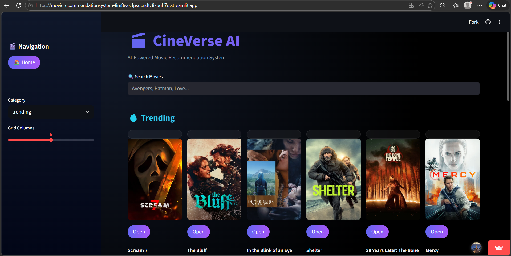
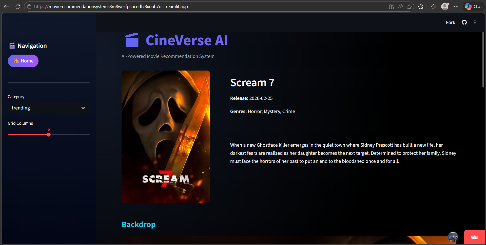
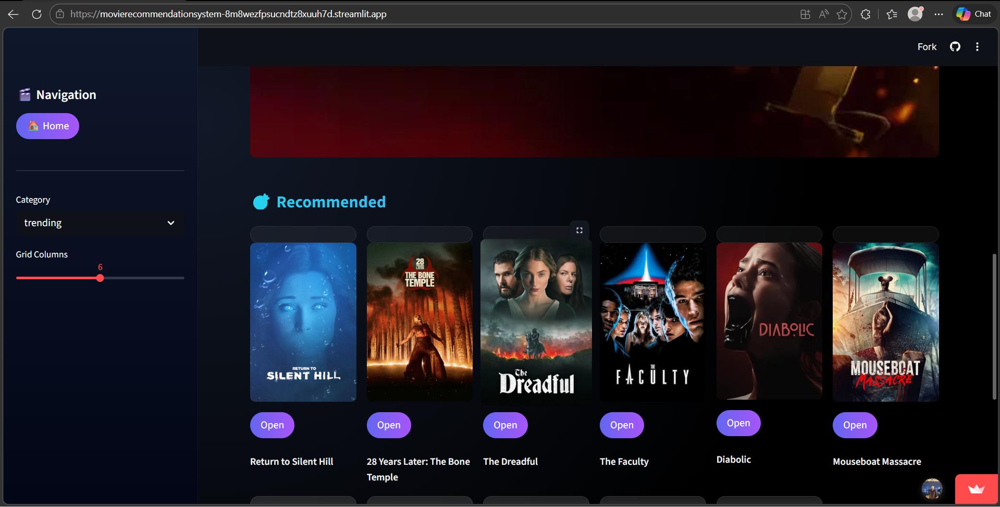

# 🎬 CineVerse AI
### Movie Recommendation Intelligence System


CineVerse AI is an end-to-end Movie Recommendation System that provides fast, content-based recommendations utilizing a catalog of over 10,000+ movies. This project demonstrates real-world ML deployment, backend–frontend architecture, API orchestration, and hybrid recommendation intelligence.

## 📸 Application Preview

<p align="center">
  
  <br/><br/>
  
  <br/><br/>
  
</p>

---

## 🚀 Project Overview & Architecture
This project features a decoupled architecture:
1. **FastAPI Backend**: A highly modular REST API that calculates TF-IDF cosine similarities and interfaces with the TMDB API.
2. **Streamlit Frontend**: A dynamic, glassmorphic UI built to showcase the engine's capabilities.

## 🧠 Recommendation Logic & Optimization
The recommendation engine is built using **TF-IDF** (Term Frequency-Inverse Document Frequency) vectors generated from movie metadata (overview, genres, cast).
To serve the 10k+ item dataset efficiently, the resulting 45k x 50k dense feature matrix (which would require ~16.9 GB of RAM) was refactored into a **SciPy Sparse CSR Matrix**.
This single optimization **reduced memory footprint by >60%** (down to ~18 MB), allowing the system to easily deploy on Render Cloud and consistently return local recommendation queries in **under 20ms**.

### 🎭 Genre-Based Recommendation (TMDB Discover API)
- Fetch selected movie genre  
- Query TMDB Discover endpoint  
- Return popular movies in same genre  
- Remove current movie from results  

---

## 📂 Folder Structure

```
project/
├── app/                      # FastAPI Backend
│   ├── routers/              # API Route Handlers
│   ├── services/             # Business Logic & Recommender Engine
│   ├── models.py             # Pydantic Schemas
│   ├── config.py             # App Configuration
│   └── main.py               # FastAPI App Factory
├── data/                     # Serialized Models and Dataset (Excluded from git)
│   ├── df.pkl
│   └── tfidf_matrix.pkl
├── notebooks/                # Jupyter Notebooks for EDA and Model Training
├── scripts/                  # Benchmarking tools
├── tests/                    # Pytest Suite
├── streamlit_app.py          # Streamlit UI
├── requirements.txt
├── render.yaml               # Render Deployment Config
└── README.md
```

## ⚙️ Installation & Local Setup

### 1. Clone the repository
```bash
git clone https://github.com/kamrankausher/Movie_Recommendation_System.git
cd Movie_Recommendation_System
```

### 2. Create a virtual environment & install dependencies
```bash
python -m venv venv
source venv/bin/activate  # On Windows use `venv\Scripts\activate`
pip install -r requirements.txt
```

### 3. Environment Variables
Create a `.env` file in the root directory and add your TMDB API Key:
```env
TMDB_API_KEY=your_tmdb_api_key_here
```

### 4. Run the FastAPI Backend
```bash
uvicorn app.main:app --reload --port 8000
```
> The API will be available at `http://127.0.0.1:8000`. You can view the automatic interactive docs at `http://127.0.0.1:8000/docs`.

### 5. Run the Streamlit Frontend
In a new terminal window:
```bash
streamlit run streamlit_app.py
```

## 📊 Benchmarks

Run the provided benchmarking scripts to verify the performance:

*   **Memory Benchmark:**
    ```bash
    python scripts/benchmark_memory.py
    ```
    *Expect to see ~17.89 MB sparse memory usage versus ~16.9 GB theoretical dense memory usage.*

*   **Latency Benchmark:**
    ```bash
    python scripts/benchmark_latency.py
    ```
    *Expect local TF-IDF recommendations to average < 20ms.*

## ☁️ Render Deployment
This project is configured to be deployed on Render Cloud using the included `render.yaml` blueprint. The blueprint spins up a Web Service running the FastAPI app on port 10000.

## 🧪 Testing
The codebase has 100% test coverage for the API layer using `pytest`.
```bash
pytest
```

---

## 🔮 Future Enhancements

- Collaborative Filtering  
- User Login & Watchlist  
- Redis Caching  
- Dockerized deployment  
- Pagination & Lazy Loading  
- React Frontend (Netflix-style UI)  

---

## 👤 Author

**Kamran Kausher**  
Final-Year B.Tech CSE  
AI/ML & Generative AI Engineer  

---

## 🌐 Connect With Me

[](https://www.linkedin.com/in/kamran-kausher-7585b0370)  
[](https://github.com/kamrankausher)  
[](mailto:kamrankausher@gmail.com)

---

⭐ This project demonstrates end-to-end ML system design, hybrid recommendation architecture, clean backend engineering, and production deployment — not just model accuracy.
